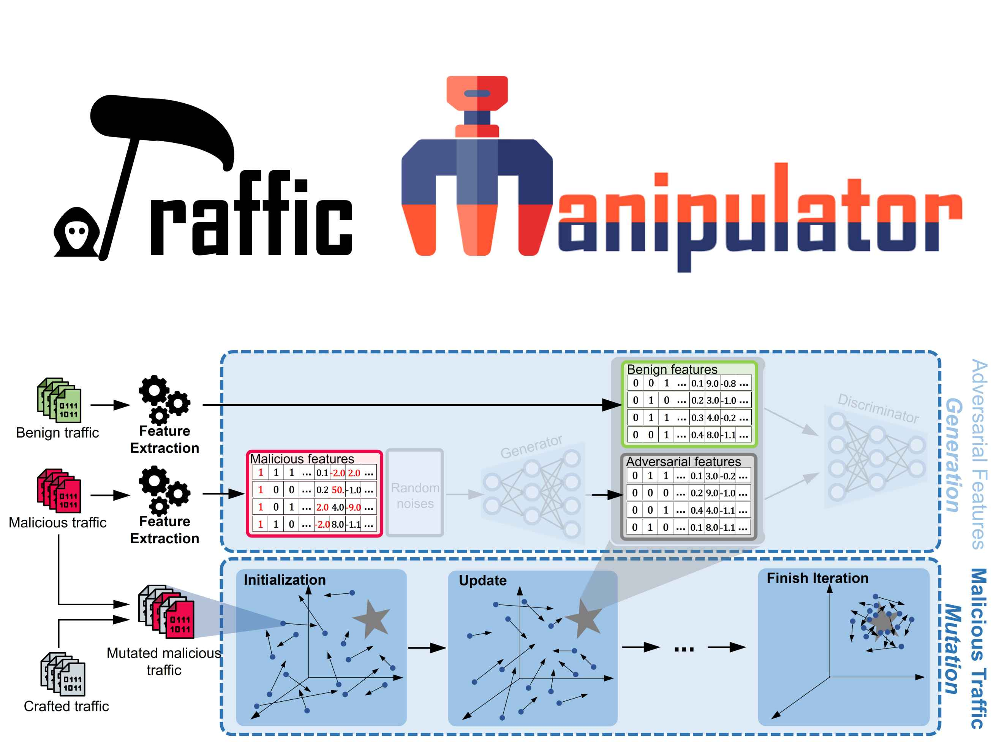
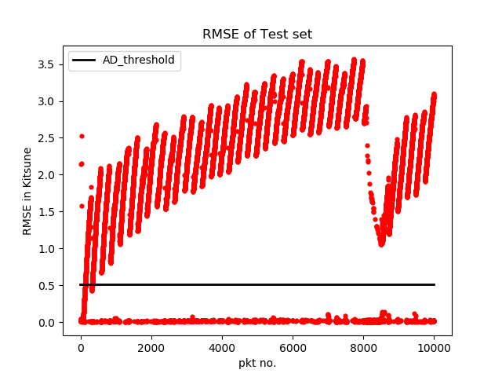
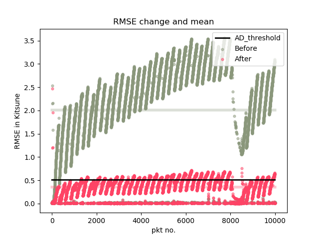

## What is Traffic Manipulator?

**Traffic Manipulator** is a *black-box* traffic mutation tool which can effectively and efficiently generate adversarial crafted traffic to evade learning-based NIDSs while preserving the original functionality. Traffic Manipulator is practical, generic and model-agnostic.

As shown in the above figure, Traffic Manipulator employs Particle Swarm Optimization (__PSO__) algorithm to search approximate solutions in the high-dimensional discrete traffic space. Given an _original (malicious) network traffic set_ and a _target feature set_, this tool can generate a *mutated network traffic* that **its features extracted by a specific extractor will be as similar as possible to the target feature set**.

## Implementation Notes

- Special Python dependencies:  **cython** and **scapy**
- The source code has been tested with Python 3.6 on a Linux 64bit and Win10  64bit machine 

To install `scapy` and `cython`, run in the terminal:
   ```
   pip install scapy
   pip install cython
   ```
 
Requirements.txt
   ```
   Cython==0.29.11
   matplotlib==3.0.3
   numpy==1.18.5
   scapy==2.4.2
   scipy==1.4.1
   ```

## Usage

1. **Prepare the targeted system and malicious traffic:** First, you need to select a targeted learning-based NIDS (including a feature extractor and a learning model in most cases). You may also select training and test set, and then compile the training set and train the model.
  
2. **Prepare a target benign feature set to mimic:** Second, the target feature set (which is classified as benign by the targeted system) need to be selected. This can be down by simply using benign features. Besides, an advanced GAN-based method to generate more suitable **adversarial features** can be found in our [paper](https://arxiv.org/abs/2005.07519).

3. **Tune parameters of Traffic Manipulator and begin to attack：** Before running this tool, the last step is to set parameters. 

See line 31 in `main.py` :

   ``` python
   # Choose Params
   m.change_particle_params(w=0.6,c1=0.7,c2=1.4)
   m.change_pso_params(max_iter=5,particle_num=10,grp_size=5)
   m.change_manipulator_params(grp_size=5,
                               min_time_extend=0.,
                               max_time_extend=5.,
                               max_cft_pkt=4,
                               max_crafted_pkt_prob=0.3)
   ```

   There are basically 9 parameters in our algorithm, which can be divided into 3 groups:

   - Internal parameters in PSO (in terms of velocity update):

       1. `w` : wight of inertia 
       2. `c1`: wight of cognitive force 
       3. `c2`: wight of social force 

   - Internal parameters in PSO  (in terms of searching configuration): 
   
       4. `max_iter`: iterations of searching 
       5. `particle_num`: total number of particles (population)
       6. `grp_size`: number of particles per neighborhood

   -  manipulator parameters :

       7. `grp_size`: number of network packets mutated for each processing (Notice it's different from the above `grp_size`)
       8. `max_time_extend`: the interarrival time of each two mutated packets in mutated traffic is no more than `max_time_extend` times original interarrival time. 
       9. `max_cft_pkt`: the maximum number of crafted packets aggregated with one original packet.

   **Simply, if you wish higher performance, increase Param 4,5,6 and 8, 9 gracefully. And if you wish to speed up results, decrease Param 4,5,6.**

## Example —— Case study on Kitsune
**Kitsune** [NDSS '18] is a state-of-the-art deep learning-based NIDS, more information can be found in this [link](https://github.com/ymirsky/Kitsune-py). In this example, we use Traffic Manipulator to evade Kitsune (i.e., generate mutated malicious traffic which can be classified as benign by Kitsune).

1. Compiling cython file in AfterImage as follows:
   ```
   cd AfterImageExtractor/
   python setup.py build_ext --inplace
   ```
2. Training KitNET (learning model in Kitsune) with the training set:
    (Note that you must under `TrafficManipulator/` path, so `cd ..` first)
   ```
   cd ../
   python KitNET/model.py -M train -tf example/train_ben.npy
   ```
3. Executing KitNET with the original malicious traffic:
   ```
   python KitNET/model.py -M exec -tf example/test.npy -rf example/test_rmse.pkl
   ```

The RMSE of original malicious traffic reported by KitNET is as follows:
<center>
 
<div>Pkts over the black line are detected as malicious (ACC=84%)</div>
</center>


4. Generating Normalizer for Kitsune (see This [issue](https://github.com/dongtsi/TrafficManipulator/issues/1) for details)

   Using `main.py` to mutate your traffic (You can use  `python main.py -h` for more details about the arguments):

   ```
   python tools.py
   python main.py -m example/test.pcap -b example/mimic_set.npy -n example/normalizer.pkl -i example/init.pcap
   ```

5. Evaluating the effectness of mutated traffic (You can use  `python eval.py -h` for more details about the arguments):

   ```
   python eval.py -op example/test.pcap -or example/test_rmse.pkl -of example/test.npy -b example/mimic_set.npy -n example/normalizer.pkl
   ```


The result should look like the figure below:
<center>
 
</center>
It can be seen that the RMSE of mutated traffic (red) are decreased significantly compared with the original traffic (green)

**For more experimental results and analysis (including attacks on multiple targeted systems, execution overhead, attack overhead, functional verification, etc.), please refer to our [paper](https://arxiv.org/abs/2005.07519).**


### More about Kitsune

We implemented the feature extractor AfterImage based on the open-source code released by [Kitsune](https://github.com/ymirsky/Kitsune-py). Here is an example for extracting features from raw packets:

   ```
   python extractor.py -i ./example/test.pcap -o ./example/test.npy
   ```

## Citations
This source code is part of our work accepted by [IEEE JSAC](https://ieeexplore.ieee.org/abstract/document/9448103):

***Evaluating and Improving Adversarial Robustness of Machine Learning-Based Network Intrusion Detectors*** 

Its pre-print version is available at [here](https://arxiv.org/abs/2005.07519). 

You can find more details in this paper, and if you use the source code, **please cite the paper** as follows:

> D. Han et al., "Evaluating and Improving Adversarial Robustness of Machine Learning-Based Network Intrusion Detectors," in IEEE Journal on Selected Areas in Communications, doi: 10.1109/JSAC.2021.3087242.

(or **BibTex**:)

@ARTICLE{9448103,  
author={Han, Dongqi and Wang, Zhiliang and Zhong, Ying and Chen, Wenqi and Yang, Jiahai and Lu, Shuqiang and Shi, Xingang and Yin, Xia},  
journal={IEEE Journal on Selected Areas in Communications},   
title={Evaluating and Improving Adversarial Robustness of Machine Learning-Based Network Intrusion Detectors},   
year={2021},  
volume={},  
number={},  
pages={1-1},  
doi={10.1109/JSAC.2021.3087242}}

